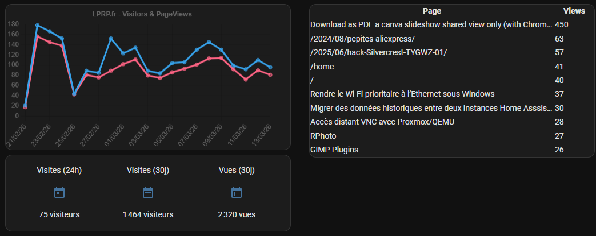

# Home Assistant configuration items for Umami Analytics

The elements in this repository helps to display some Web Analytics managed in [Umami](https://github.com/umami-software/umami) inside Home Assistant.

Example cards:


Features:
- display visitors & page views graph (proxy)
- display top URLs (proxy)
- Home Assistant sensors to track statistics


# Installation

This is not (yet?) bundled as HACS repository, and no UI configuration, you will need to:
- copy the required files in your Home Assistant installation (see below)
- set up the items in your Home Assistant configuration.yaml
- restart Home Assistant so new elements are added


# Items

## http_proxy_script custom component

This component can serve as proxy the result of any script.

This component is not specific to umami and can be used for any other use case
 where you need to have some secrets managed by an authenticated backend
 or just if you want to serve data only to authenticated Home Assistant users

```yaml
proxy_scripts:
- id: umami_views
  script: /config/scripts/umami.py --days 30 --data pageviews --chartjs
  args:
  - !secret umami_share_url
```

(this example require a `umami_share_url` key in your `secrets.yaml` with a Umami share url)

You will then be able to use under `/api/proxy_scripts/<id>` endpoint
or with the javascript code `this._hass.callApi('GET', 'proxy_scripts/<id>'`

You will find an example in the provided card


## Cards card-proxy-graph & card-proxy-table

Thoses cards are not specific to Umami and can display the data as table or graph (rendered with [ChartJS](https://www.chartjs.org/docs/latest/))

You will need to:
- upload the javascript card-prox.js in your config/www/ folder
- add the javascript ressource in Home Assistant (Dashboard / Edit / Manage ressources) as `/local/card-proxy.js?v=1`  (increment when you need to force cache to refresh the file)
- configure in yaml in your dashboard, see example below

Example for Graph card:
```yaml
type: custom:card-proxy-graph
refresh_seconds: 3600
query_id: umami_views
title: LPRP.fr - Visitors & PageViews
height: "160"
chartjs:
  options:
    plugins:
      legend:
        display: false
```

The data fetched from API proxy is considered as valid structure for ChartJS and used as such. You can override this with the chartjs object and redefine anything you want.


Example for Table card:
```yaml
type: custom:card-proxy-table
refresh_seconds: 3600
query_id: umami_top_path_with_titles
grid_template: 1fr 5em
columns:
  - key: path
    label: Page
    template: >-
      <a href='https://lprp.fr{{path}}' target='_blank' style='text-decoration:
      none; color: currentColor'>{{ title | replace: '\x7C LPRP.fr' | default:
      path}}</a>
  - key: count
    label: Views
```


## umami.py script

This script is specific to Umami, and will fetch data from a Umami shared dashboard URL.
The script will handle:
- to get a valid API token from the share URL
- to make the API calls to get the data
- manage the formatting for use with the ChartJS card

This script is standalone, so it can be used through the proxy with the cards, or in command_line sensors, or any other use context.

You will get all options with `--help` parameter

## Sensors

You can add  command_line sensors to get data from the above scripts into Home Assistant.

```yaml
command_line:
- sensor:
    name: "Umami - Visiteurs (30 jours)"
    unique_id: sensor_umami_visits
    command: "/config/scripts/umami.py --days 30 {{ states('input_text.umami_share_url') }}"
    scan_interval: 300
    value_template: "{{ value_json.visitors }}"
    unit_of_measurement: "visiteurs"
```

# Develop

This repository contains a devcontainer.json to help to develop locally with vscode.

